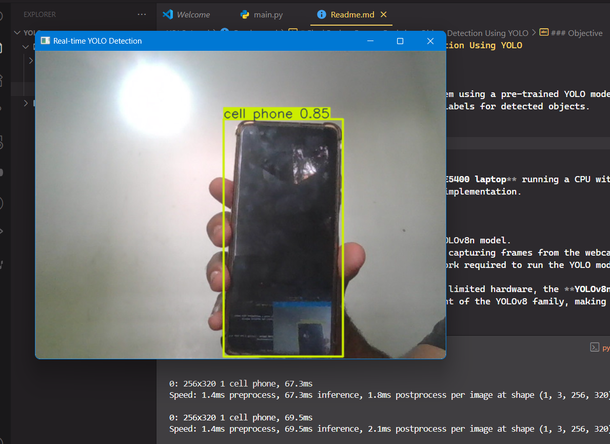
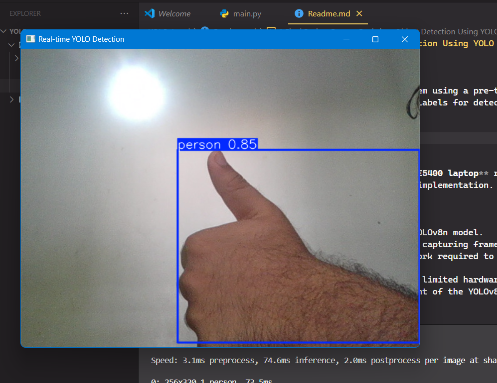
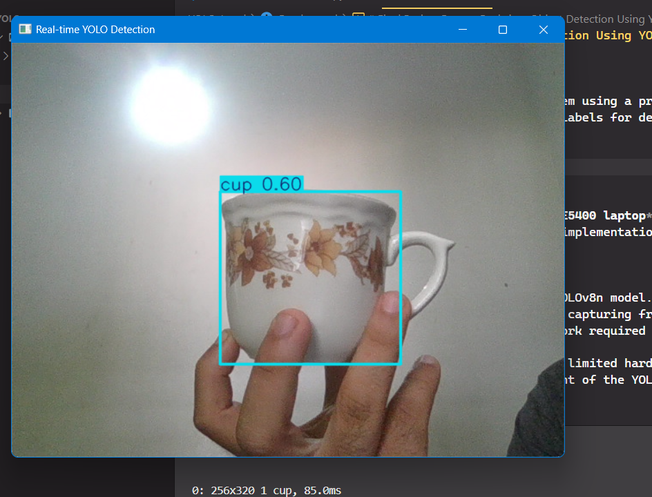
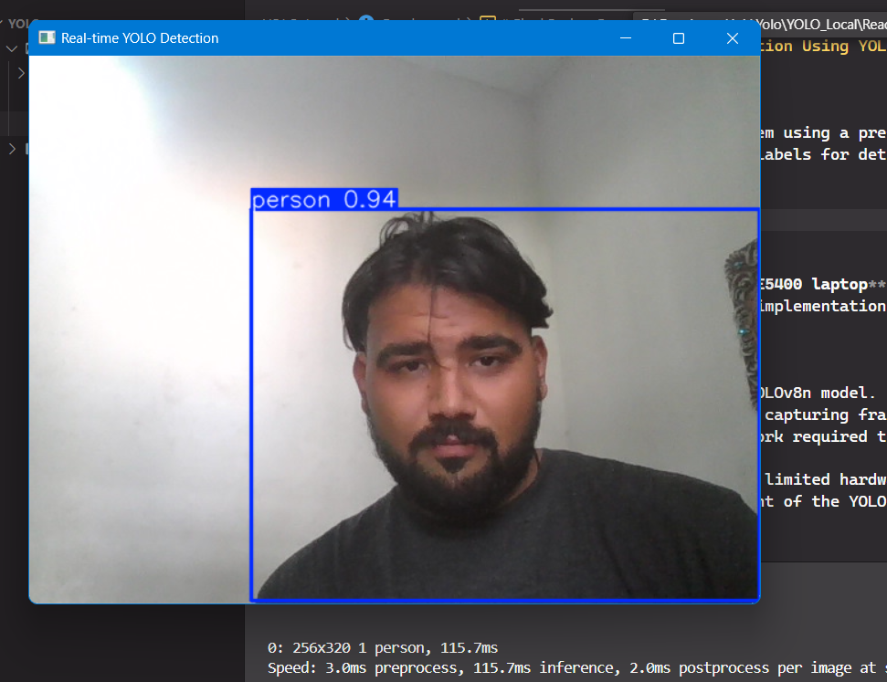
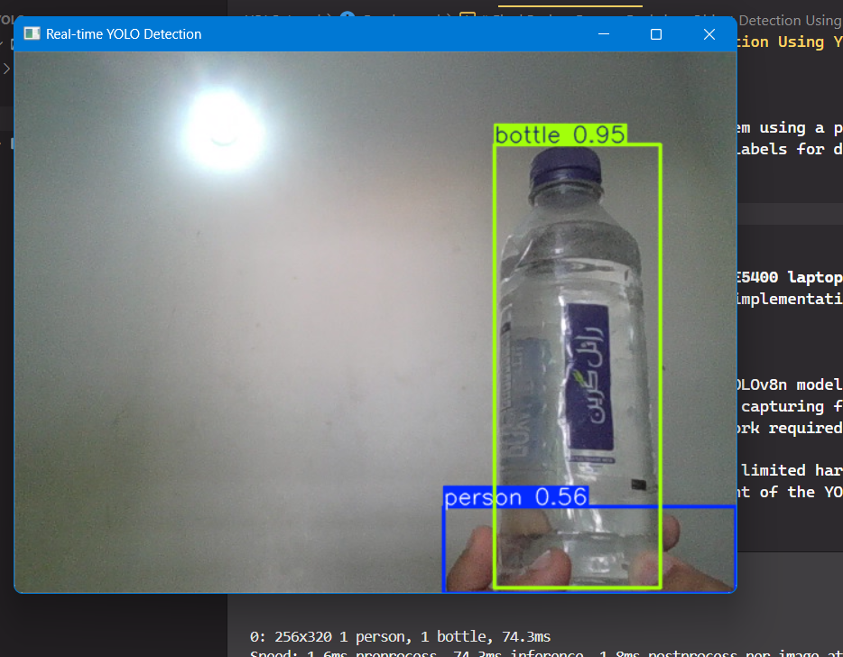
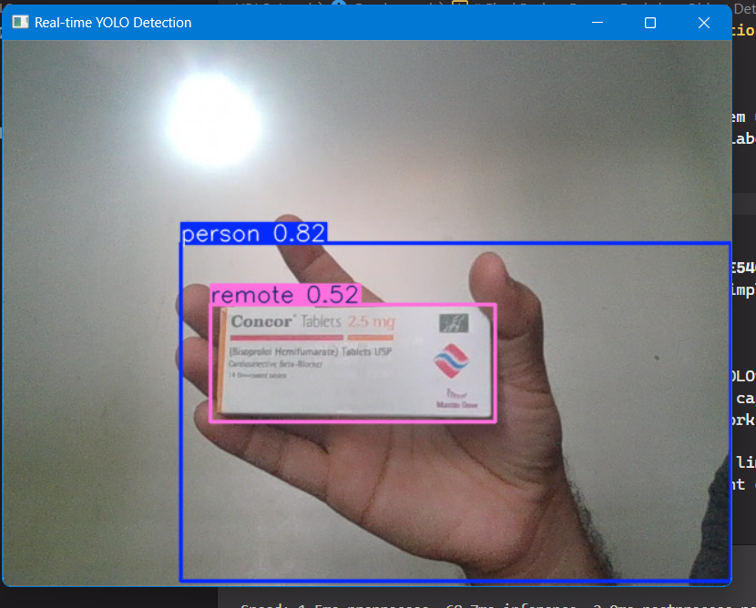

# Final Project Report: Real-time Object Detection Using YOLO

### **Objective**

To implement a real-time object detection system using a pre-trained YOLO model, process live video from a webcam, and display bounding boxes with class labels for detected objects.

---
### **Observations**

---
### **1. System Setup and Environment**

The system was developed on a **Dell Latitude E5400 laptop** running a CPU with no dedicated GPU. This hardware limitation was a primary consideration during implementation.

**Key Libraries Used:**

- `ultralytics`: For accessing and using the YOLOv8n model.
- `opencv-python`: For handling video streams, capturing frames from the webcam, and displaying the output.
- `torch` (CPU-only): The deep learning framework required to run the YOLO model on the CPU.

To ensure compatibility and performance on the limited hardware, the **YOLOv8n** (nano) model was chosen. This model is the smallest and most efficient variant of the YOLOv8 family, making it suitable for CPU-based inference.

---

### **2. Performance Analysis**

The system successfully performed real-time object detection, though with a noticeable performance bottleneck due to the absence of a GPU.

**Speed:** The video feed was **choppy** but remained functional. The system achieved a frame rate of approximately **3-5 FPS** (Frames Per Second). This is an expected limitation of running a computationally intensive task like object detection on a CPU.

**Accuracy:** The model's accuracy varied significantly depending on the object class and lighting conditions.

- **High Accuracy:** The model performed **reliably** when detecting **people, cell phones, and laptops**. The bounding boxes were accurately sized and placed around these objects, demonstrating a strong understanding of their features.
- **Low Accuracy:** The model struggled with less common or less clearly defined objects. It misclassified several items, indicating a gap in its learned features for those specific classes.
  - A medicine packet was incorrectly identified as a `remote`.
  - An open wallet was detected as `two cell phones`.
  - Paper money was also classified as a `remote`.

The bounding boxes generally `resized themselves accurately` to fit the objects, even when they were partially visible or at different distances.

---

### **3. Conclusion**

The implementation successfully met the core requirements of the task. It demonstrated the ability to set up a real-time object detection system, process video, and display accurate detections for certain object classes.

However, the lack of a GPU proved to be a significant limiting factor, resulting in a low FPS and making the system unsuitable for applications requiring true real-time performance (e.g., 24+ FPS). The model's accuracy also showed inconsistencies for classes beyond its most well-trained categories (person, electronics), highlighting the importance of using a model trained on a diverse and relevant dataset for specific use cases.
